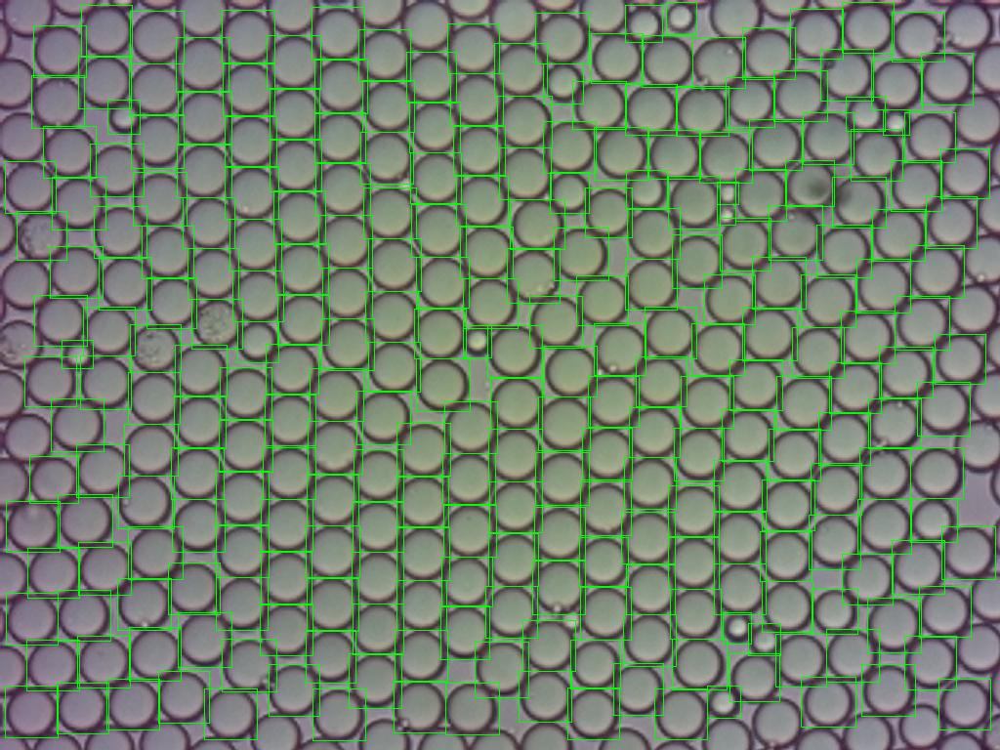

# MAIN FUNCTIONALITIES
To predict the droplets in an image, write on the terminal "python **main.py**" while being on the repository's root. This will give the option to get the dimentions and to show the bounding boxes of the droplets given by the detection model.

The droplets detected at the borders of the image are not counted. The reason for this is that most of them are cropped and do not appear whole. Since their actual size is unknown, their inclusion would drift the mean value of the dimentions away from the real value.

The area of droplets it's calculated asumming droplets have the form of an ellipse, whichs' axis are paralel to the x and y axis from the main picture.

To illustrate, in green the real area that is calculated, in red the error area that is calculated and in yellow the area that is missed by the calculation.

Change the values in **PARAMETERS.py** in order to change the image that is analized, the weights used, wether the result is saved in /saved_results, etc.

Currently the best weight is **best_9.pt**. This one gives better sizes for the boxes and it detects more droplets.

## Some Results with **best_9.pt**

The standard deviation of the parameters, such as width, height and area is calculated with this incremental formula:

This formula allows to "add" the standard deviation of two or more images together, without having to store all of the dimentions of droplets. Basicly, after calculating the standard deviation once, the values from which it was calculated can be forgotten, since they won't be necessary when we want to calculate the new standard deviation from adding another set of droplets. 

# THE TRAINING FIELD
The weights are created in the training_field directory with the **train.py** file. This training is configured to use a nvidia graphics card with the NVIDIA CUDA toolkit. By doing this, the processing occurs in the GPU. This greatly improves the speed in which the training is done, but requires to download nvidia CUDA, nvidia CUDNN and to get a compatible version of PYTorch.

What the training does is: make the model predict the droplets on hundreds of images and see how correct the prediction is. This is done by checking the labels (coordinates of the droplets). The model then learns from this and keeps what worked and discards what didn't. Finally the model gives this "what worked and what didn't" in form of a weight (a .pt file), which is what we use in **main.py**.

The training is performed on "artificially" generated images and labels. Which are created using the **make_training_data.py** file.

## Training Images
This images are created by pasting hand-made cutouts of real droplets on random places of real background photos. These real samples are stored in the **real_samples** directory in the **training_field** and the Training Images are stored in **datasets**. On this directory the labels of the pasted droplets are also stored on the labels directory. 

New droplets are added to **real_samples** frequently. These are often edge cases that the model didn't recognize, so by adding them we can train the model again, so that it can recognize these "weird" droplets next time.

However, adding new droplets is not the only technique used to improve the detection rate. When placed, droplets are randomly: rotated, streched, given transparency and darkened. These have proven to be very good techniques, and have made the general detection error much lower.

The droplets in generated images will not overlap with eachother, except for a 6 pixel margin. This is made to better simulate the droplet proximity of real photos.

The droplets and backgrounds used are choosen randomly for every training image.

The background image is cropped to 640 pixels x 640 pixels when generating training images. The original size of 1024*704 became to heavy for the training, making it spend twice the memory and taking twice the time. 640 x 640 was a good medium point to train faster. So, to be clear. This change of size DOES NOT impact the precission of the final product, but it DOES increase the speed of the training.

# Requirements
The libraries needed to run main.py are **ultralytics**, **pillow**, **opencv-python** and **tabulate**. These can be automaticly installed by running **packages.py**.
