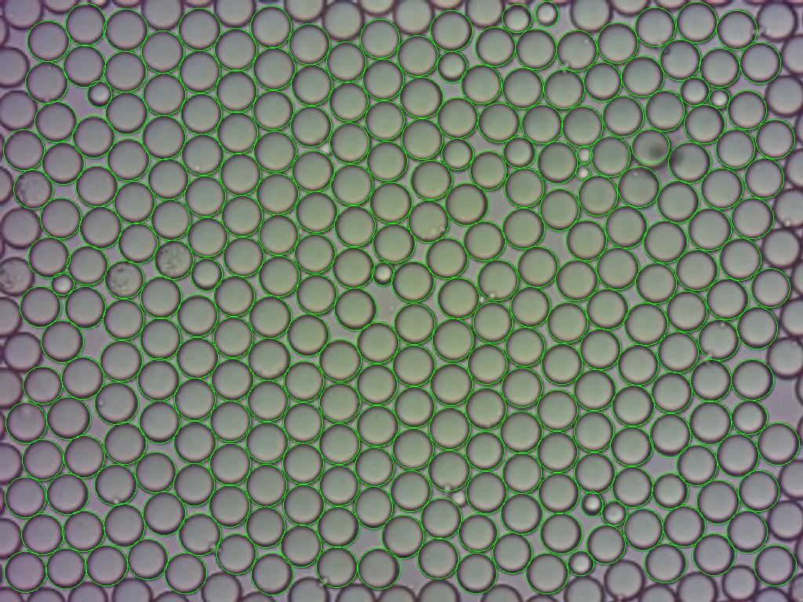
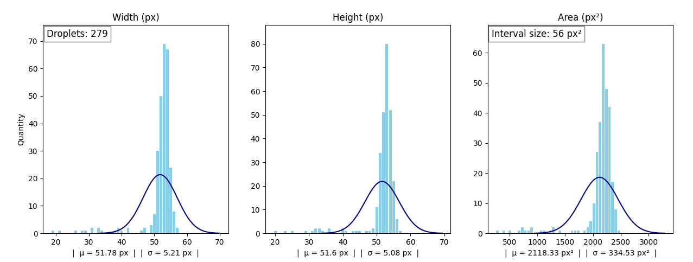
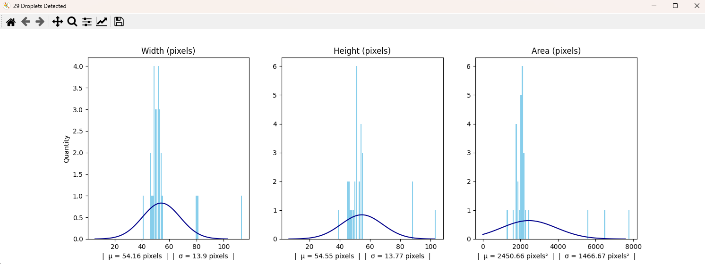
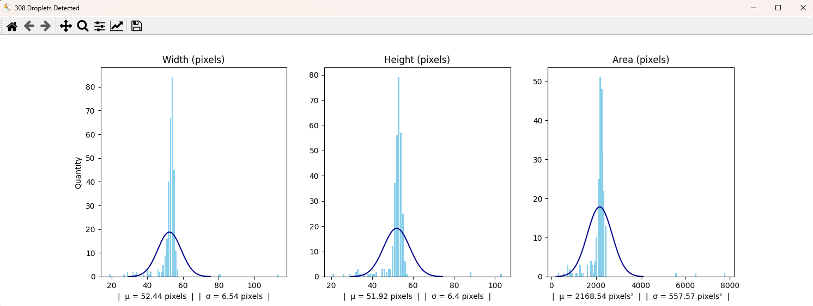
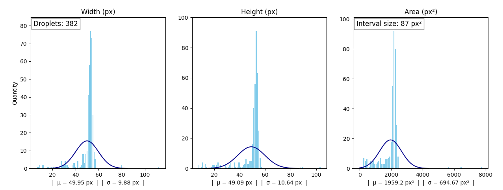

# Introduction
This repository implements machine learning to detect droplets on images. After the detection is performed, the data of the dimentions of this images is calculated and shown.

# Main functionalities
There are two programms in this repository that a normal user would like to run: **test_functions.py** and **main.py**. 

## test_functions.py
With this programm you can use the prediction model on a single image. You may choose to use the results of the prediction to visualize the detection, to show the distribution of the detected droplets' dimentions or both.

## main.py
This programm starts the webcam of your device and takes pictures periodicly. With each picture, the programm runs a prediction of the droplets in it and then collects the data of the dimentions of these. The data of the dimentions is then constantly used to update the visual interface of the density distribution of width, height and area.

### Change the parameters in these programms
Change the values in **PARAMETERS.py** in order to change: the pixel ratio, the unit of meassurement, the weight used in the model, the image that is analized in **test_functions.py**, wether the result is saved in /saved_results, among other things. (in the current version some of the parameters, such as IMGSZ, are hardcoded).

## Some Results
[More results found here](https://github.com/wenzel-lab/droplet_AInalysis/tree/main/saved_results)

### snapshot 45

### snapshot 22

### snaphsot 45 + snapshot 22

 

# MATHS AND PROCESSING

### Discarded droplets
In the first image seen above, one might think that all of the droplets at the borders of the image are wrongfully not being detected. However this is not the case. The model does detect them, but they are not counted. The reason for this is that most of the droplets at the borders do not appear whole. Since their actual size is unknown, their inclusion would drift the mean and standard deviation of the dimentions away from the real values. 

The following image is the same image from above, but it does count the droplets in the borders. The problem can inmediatly be seen.

<!--  -->

### Area of droplets
The area of droplets it's calculated asumming droplets have the form of an ellipse, whichs' axis are paralel to the x and y axis from the main picture.

To illustrate, in green the real area that is calculated, in yellow the area that is missed by te calculation and in red the error area that is calculated.

### How data is added and an explanation of batches

The standard deviation of the parameters, such as width, height and area is calculated with the incremental formula of the standard deviation:

This formula allows to "add" the standard deviation of two or more images together, without having to store all of the individual dimentions of droplets. Basicly, after calculating the standard deviation once, the values from which it was calculated can be forgotten, since they won't be necessary when we want to calculate the new standard deviation from adding another set of droplets.

All data colected from the model's prediction is stored in an instance of `ImageData`. This instances can be added with each other easily. By doing `image_data_combined = image_data1 + image_data2` you will get a new instance of `ImageData`. This instance will have as attributes: the new mean given by considering the two images, the new standard deviation, the new data for making the graphs and the new total ammount of droplets.

The way this data is stored isn't straight forward. To allow to forget images after a given time, the data is stored in batches of a given size. These batches can not be more numerous than the defined maximum ammount of batches. An example of this: if we have added 20 images into an instance of `ImageData`, which has a batch size of 10 and a maximum ammount of batches of 2. The instance would be storing the maximum ammount of data permited. So, the current mean value of the width is all of the widths from all of the images added up, divided by the ammount of droplets from the 20 images. But if we add another image, the instance would forget the first batch, since its maximum ammount of batches has been surpassed. Consequently, the instance would "forget" the first ten images and would consider only the previous last ten images plus the newly added image.

Currently the batches are configured to be of size 60 and to not surpass a quantity of 5. If we assume a refresh rate of 60 frames per second, this would mean storing the data of the previous five seconds. Therefore, when 5 seconds are surpassed, the first second of data is forgotten. 

# THE TRAINING FIELD
The weights are created in the training_field directory with the **train.py** file. This training is configured to use a nvidia graphics card with the NVIDIA CUDA toolkit. By doing this, the processing occurs in the GPU. This greatly improves the speed in which the training is done, but requires to download nvidia CUDA, nvidia CUDNN and to get a compatible version of PYTorch.

What the training does is: make the model predict the droplets on hundreds of images and see how correct the prediction is. This is done by checking the labels (coordinates of the droplets). The model then learns from this and keeps what worked and discards what didn't. Finally the model gives this "what worked and what didn't" in form of a weight (a .pt file), which is what we use in **main.py**.

The training is performed on "artificially" generated images and labels. Which are created using the **make_training_data.py** file.

## Training Images
This images are created by pasting hand-made cutouts of real droplets on random places of real background photos. These real samples are stored in the **real_samples** directory in the **training_field** and the Training Images are stored in **datasets**. On this directory the labels of the pasted droplets are also stored on the labels directory. 

New droplets are added to **real_samples** frequently. These are often edge cases that the model didn't recognize, so by adding them we can train the model again, so that it can recognize these "weird" droplets next time.

However, adding new droplets is not the only technique used to improve the detection rate. When placed, droplets are randomly: rotated, streched, given transparency and darkened. These have proven to be very good techniques, and have made the general detection error much lower.

The droplets in generated images will not overlap with eachother, except for a 6 pixel margin. This is made to better simulate the droplet proximity of real photos.

The droplets and backgrounds used are choosen randomly for every training image.

The background image is cropped to 640 pixels x 640 pixels when generating training images. The original size of 1024*704 became to heavy for the training, making it spend twice the memory and taking twice the time. 640 x 640 was a good medium point to train faster. So, to be clear. This change of size DOES NOT impact the precission of the final product, but it DOES increase the speed of the training.

# Requirements
The libraries needed to run main.py are **ultralytics**, **pillow**, **opencv-python** and **tabulate**. These can be automaticly installed by running **packages.py**. 

(New libraries are added normally, so these requirements could be outdated)
