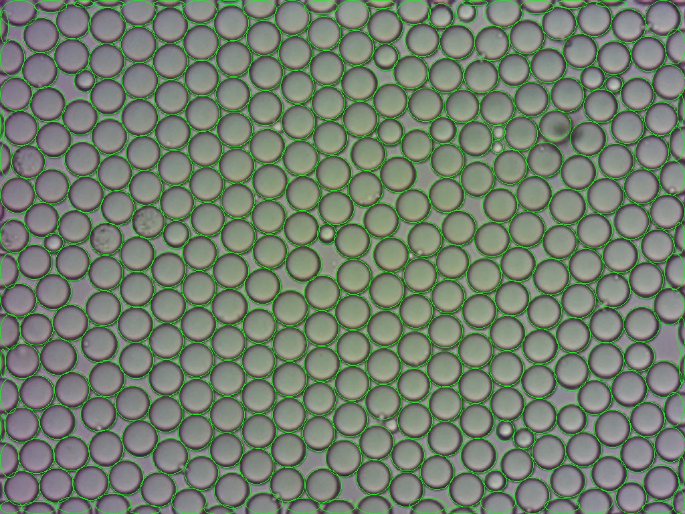
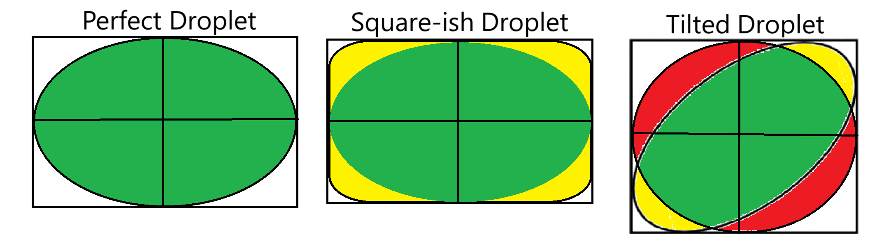
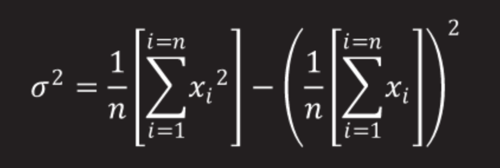
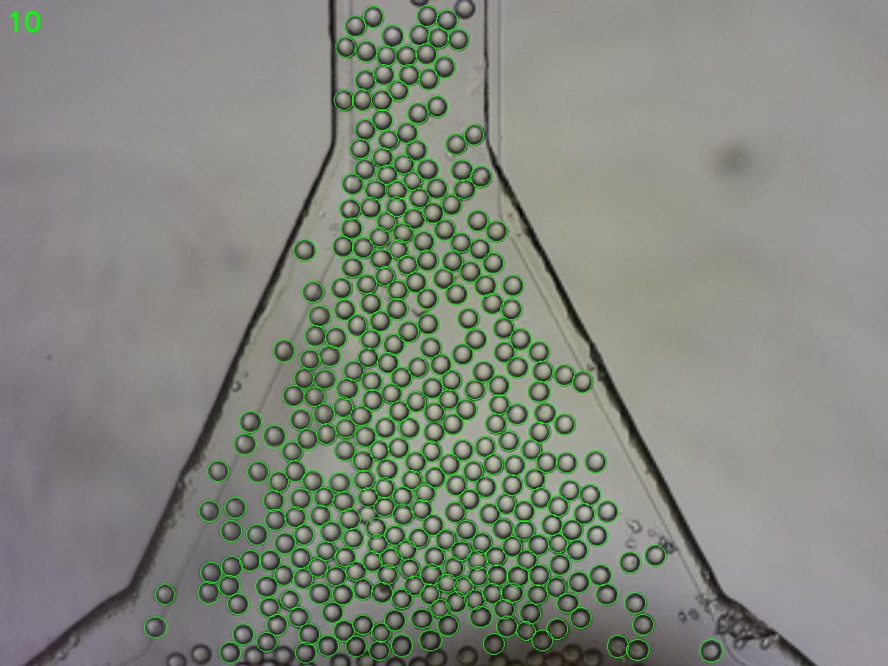
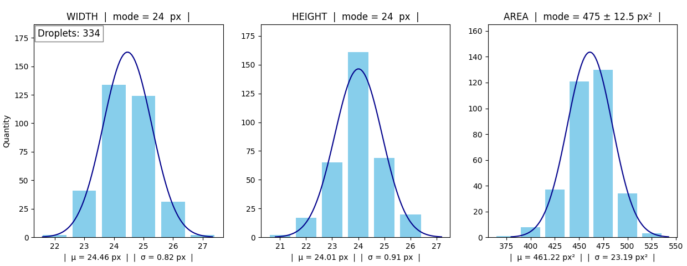

# Droplet AInalysis

[](https://github.com/wenzel-lab/droplet_AInalysis/actions)
[](LICENSE)
[](https://www.python.org/)

Automated detection and analysis of microfluidic droplets using deep learning (YOLOv8). Supports both real-time webcam analysis and static image batch processing, with rich statistics, annotated outputs, and visualizations.

---

## 🚀 Features

| Feature                           | Description |
|-----------------------------------|-------------|
| 🖥️ **Live webcam analysis**        | Real-time droplet detection, statistics, and unified preview/plots |
| 🖼️ **Static image analysis**       | Batch or single-image processing, model benchmarking |
| 📊 **Cumulative statistics**       | Tracks droplet size/volume across frames/images |
| 📈 **Interactive plots**           | Live histograms, normal fits, and graphical UI |
| 📝 **CSV & annotated outputs**     | Exports per-droplet and summary data, images, GIFs |
| 🏷️ **Model comparison**            | Test multiple YOLO weights, auto-select best |
| 🧩 **Easy extensibility**          | Modular design, clear configs, and example suite |

---

## 📑 Table of Contents

- [Features](#-features)
- [Repository Structure](#-repository-structure)
- [Installation & Requirements](#-installation--requirements)
- [Quick Start](#-quick-start)
- [Outputs & Results](#-outputs--results)
- [Configuration & Parameters](#-configuration--parameters)
- [Troubleshooting](#-troubleshooting)
- [Maths and Processing Details](#-maths-and-processing-details)
- [Model Training and Weights](#-model-training-and-weights)
- [More Information](#-more-information)
- [Contributing](#-contributing)
- [License](#-license)
- [Citation](#-citation)
- [Credits](#-credits)

---

## 📂 Repository Structure

- `webcam-v1/` — Real-time webcam droplet detection (live mode, unified UI, terminal mode)
- `static-image-v1/` — Analyze static images or batches, benchmark models, export stats and plots
- `examples/` — Ready-to-run sample suite with images, weights, and scripts for demo/testing
- `imgs/` — (in each module) Holds input images and output results
- `weights/` — YOLOv8 model weights (`.pt` files)
- `packages.py` & `requirements.txt` — Dependency management

---

## 💻 Installation & Requirements

- Python 3.8+
- [Ultralytics YOLOv8](https://github.com/ultralytics/ultralytics)
- numpy, pandas, matplotlib, seaborn, opencv-python, torch, tabulate, imageio

Install all dependencies:
```bash
python packages.py
# or
pip install -r requirements.txt
```

---

## ⚡ Quick Start

### 1. **Webcam (Live) Analysis**
- Go to `webcam-v1/` and run:
  ```bash
  python main.py
  ```
- Choose mode: Graphical (G), Live View (L), Both (B), or Terminal (any other key)
- View live stats, plots, and annotated video in a unified UI window

### 2. **Static Image Analysis**
- Go to `static-image-v1/` and run:
  ```bash
  python main.py
  ```
- Choose to analyze a single test image or all images in `imgs/real_imgs/`
- Optionally, test all YOLO weights and auto-select the best
- Results (annotated images, plots, CSVs, GIFs) saved in `imgs/results/<image_name>/`

### 3. **Examples & Demo Scripts**
- Go to `examples/` and try:
  ```bash
  python see_ellipses.py
  python see_distributions.py
  ```
- Uses included sample images and weights for instant results

---

## 📤 Outputs & Results

- **best_prediction.jpg** — Annotated image with overlays
- **droplet_statistics.png** — Diameter & volume histograms
- **droplet_measurements.csv** — Per-droplet and summary statistics
- **history.gif** — GIF of predictions per model/weight
- **model_performance.png** — Model comparison chart

Unified UI (webcam mode) shows live video, diameter, and volume stats in one window.

---

## ⚙️ Configuration & Parameters

- Edit `PARAMETERS.py` in each folder to adjust:
  - `TEST_IMAGE`, `WEIGHT`, `IMGSZ`, `CONFIDENCE`, `MAX_DETECT`, `PIXEL_RATIO`, `UNIT`
- Place your own images in `imgs/real_imgs/` and YOLO weights in `weights/`
- For webcam: change camera index in `backend.py` if needed

---

## 🛠️ Troubleshooting

- **Performance drops:** Unified UI is resource-intensive; use lower modes on low-end hardware
- **Webcam not found:** Check device index or permissions
- **Plot/UI issues:** Ensure all dependencies are installed; try running with admin rights
- **Model errors:** Confirm YOLOv8 weights are compatible and in the correct folder

---

# 📐 Maths and Processing Details

## Discarded Droplets at Image Borders

Droplets touching the image borders are **intentionally excluded** from statistics. Although the model detects them, their true size is ambiguous (as they are not fully visible), which would skew mean and standard deviation calculations. Including these partial droplets can significantly distort the analysis:



*Above: Including border droplets leads to visible errors in statistics.*

---

## Area and Volume Calculations

- **Area:** Each droplet is assumed to be an ellipse, with axes parallel to the image axes. The area is calculated as:
  
  `Area = π × (w / 2) × (h / 2)`  
  where `w` and `h` are the bounding box width and height.

  

- **Volume:** Estimated by assuming a sphere with diameter equal to the mean of the bounding box width and height:
  
  `Volume = (4/3) × π × (d / 2)^3`, where `d = (w + h) / 2`

---

## Efficient Statistics and Batching

- **Incremental Statistics:**
  The standard deviation and mean are calculated using an incremental formula, allowing new images to be added without storing all individual droplet measurements:

  

- **Batching:**
  Data is stored in batches (default: 60 images per batch, up to 5 batches). When the maximum number of batches is exceeded, the oldest batch is discarded. This allows the system to “forget” older data and focus on recent results, which is ideal for live analysis.

- **ImageData Class:**
  All statistics are encapsulated in `ImageData` objects, which can be combined using the `+` operator:
  ```python
  image_data_combined = image_data1 + image_data2
  ```
  This merges statistics, means, standard deviations, and distributions.

---

## Units and Pixel Ratio

Droplet sizes are measured in pixels by default. To convert to physical units, adjust `PIXEL_RATIO` and `UNIT` in `PARAMETERS.py`:

```python
PIXEL_RATIO = 1.0   # e.g., 0.5 for 0.5 mm/pixel
UNIT = "px"         # e.g., "mm"
```

This enables flexible adaptation to different microscopes or imaging setups.



---

# 🏋️ Model Training and Weights

YOLOv8 weights (`.pt` files) are trained using the `train.py` script in the `training_field` directory. Training uses NVIDIA CUDA for GPU acceleration (requires compatible hardware, CUDA Toolkit, and cuDNN).

- **Process:**
    1. The model predicts droplets on hundreds of labeled images.
    2. Loss is computed by comparing predictions to ground truth labels.
    3. The model iteratively improves, saving the best-performing weights.
- **Data:**
    - Training images and labels are generated using `make_training_data.py`.
    - Resulting weights are stored in the `weights/` directory for use in analysis scripts.

For more information on training or customizing models, see the `training_field/README.md` (if available) or contact the maintainers.
```


```py
PIXEL_RATIO = 0.5
UNIT = "mm"
```


For more details on training or customizing models, see `training_field/README.md` or contact the maintainers.

---

## 📚 More Information

- See each module's `README.md` for detailed usage, controls, and advanced options
- Example suite (`examples/README.md`) provides a hands-on introduction
- For support or questions, open an issue or contact the maintainers

---

## 🤝 Contributing

Contributions, bug reports, and feature requests are welcome! To contribute:

- Fork the repository and create your branch from `main`.
- Make your changes and add descriptive commit messages.
- Ensure your code is well-documented and tested.
- Submit a pull request with a clear description of your changes.

See `CONTRIBUTING.md` for more guidelines (or create one if it does not exist).

---

## 📝 License

This project is licensed under the [MIT License](LICENSE). You are free to use, modify, and distribute this software with attribution.

---

## 📖 Citation

If you use Droplet AInalysis in your research, please cite it as follows:

```bibtex
@misc{dropletAInalysis,
  author       = {Your Name and Collaborators},
  title        = {Droplet AInalysis: Automated Microfluidic Droplet Detection and Analysis},
  year         = {2025},
  howpublished = {\url{https://github.com/wenzel-lab/droplet_AInalysis}},
  note         = {Version X.Y}
}
```

If you publish work using this code, please include a citation and consider letting us know!

---

## 👩‍🔬 Credits

**Authors:** Domingo Veloso-Arias, Pierre Padilla-Huamantinco, and Tobias Wenzel

Special thanks to the open-source community and Ultralytics for YOLOv8.