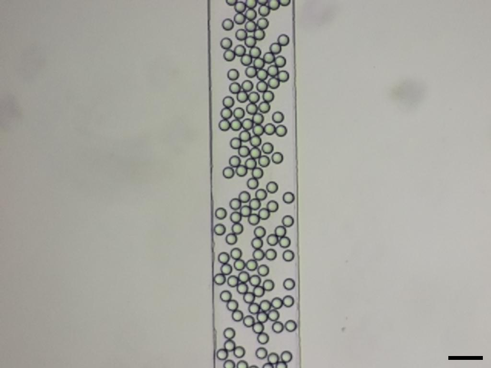
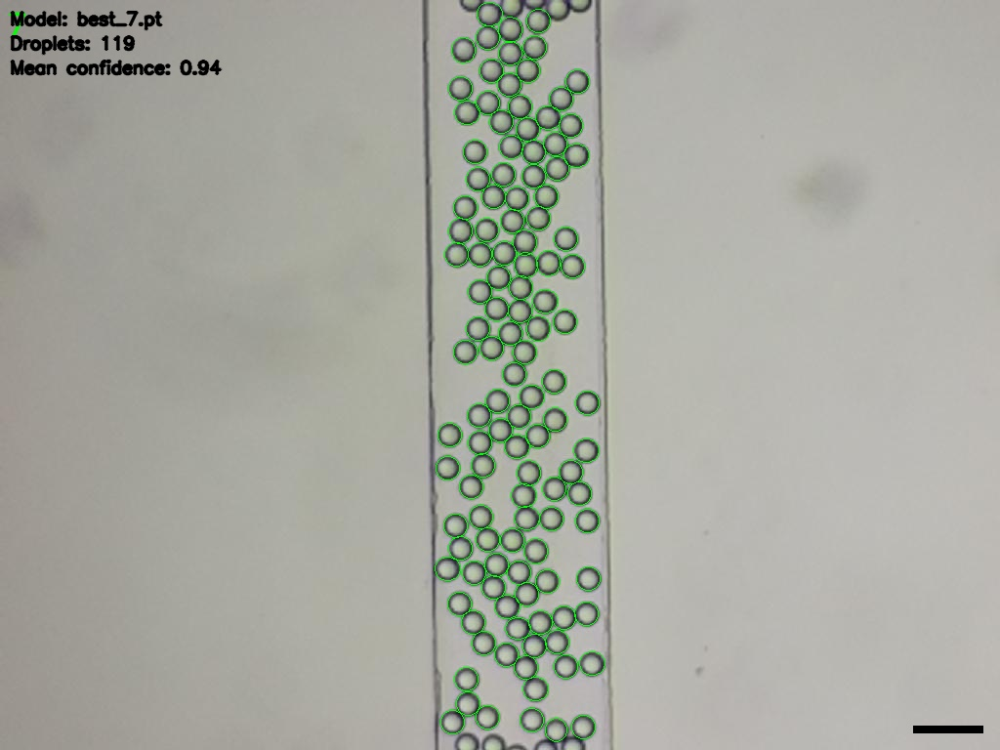
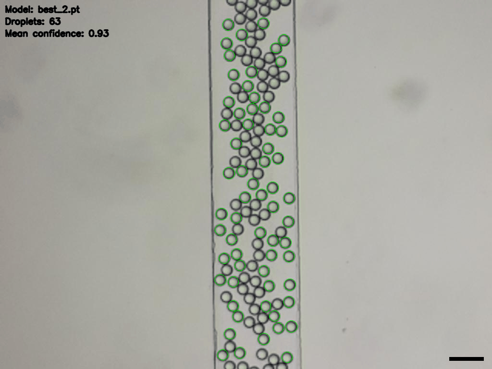

# Droplet AInalysis – Static Image Version (v1)

This tool performs automated detection and analysis of droplets in static microscopy images using deep learning (YOLOv8). It generates annotated images, droplet size/volume statistics, and visual summaries (including Gaussian fits). Designed for researchers working with droplet microfluidics or similar applications.

---

## ✅ Features

| Feature                        | Description |
|--------------------------------|-------------|
| 📷 **Static image input**      | Analyze single or batch images (`.png`, `.jpg`) |
| 🧠 **YOLOv8-based detection**  | Uses Ultralytics models (`.pt`) for droplet identification |
| 🥇 **Model selection**         | Automatically compares weights and selects the best model |
| 📊 **Histogram + normal fit**  | Plots diameter and volume distributions with Gaussian overlay |
| 📁 **CSV export**              | Saves per-droplet and summary statistics |
| 🎞️ **GIF of model iterations**| Generates a visual history of model predictions |

---

## 📦 Installation & Requirements

- Python 3.8+
- [Ultralytics YOLOv8](https://github.com/ultralytics/ultralytics) (`pip install ultralytics`)
- numpy, pandas, matplotlib, seaborn, opencv-python

Install requirements:
```bash
pip install -r requirements.txt
```

---

## 🚀 Usage

1. Place your images in the `imgs/real_imgs/` directory.
2. Place YOLOv8 model weights (`.pt` files) in the `weights/` directory.
3. Run the analysis script:
    ```bash
    python main.py
    ```
Then choose:
- Whether to analyze a single test image (`PARAMETERS.py`) or all images
- Whether to use the predefined YOLO model or test all .pt models and select the best by score

4. Results will be saved in `imgs/results/<image_name>/`

---

## 📂 Outputs (per image)

| File                        | Purpose                          |
|-----------------------------|----------------------------------|
| `best_prediction.jpg`       | Annotated image with overlays    |
| `droplet_statistics.png`    | Diameter & volume histograms     |
| `droplet_measurements.csv`  | Droplet-level data and summary   |
| `history.gif`               | GIF of predictions per model     |
| `model_performance.png`     | Model comparison chart           |

---

## 🖼 Example

Example input images and output files can be found in `imgs/results/droplets/`.

INPUT:


OUTPUT:




---

## Configure Parameters

Adjust `PARAMETERS.py` to control behavior:

```bash
TEST_IMAGE = "droplets.png"
WEIGHT = "best_model.pt"
IMGSZ = 1024
CONFIDENCE = 0.75
MAX_DETECT = 500
PIXEL_RATIO = 1.0
UNIT = "µm"
```