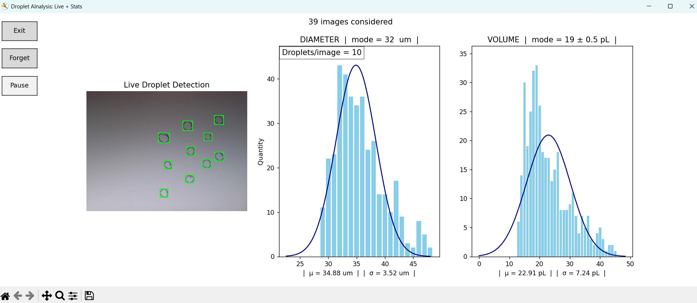

# Droplet AInalysis – Webcam Version (v1)

This tool enables real-time droplet tracking and cumulative statistical analysis using a connected webcam and a trained YOLOv8 model.

Designed for live experiments, it detects droplets in a continuous flow and provides instant feedback via terminal or interactive plots.

---

## ✅ Features

| Feature                          | Description |
|----------------------------------|-------------|
| 🧪 **Live droplet detection**     | Detects droplets in a continuous video stream from a webcam |
| 📈 **Cumulative statistics**      | Tracks and aggregates droplet sizes across frames |
| 📊 **Graphical plot mode**        | Real-time histograms of diameter and volume with normal distribution overlays |
| 🖥️ **Unified Live+Stats UI**      | Combined live webcam preview and statistics/plots in a single window |

---

> **Note:**
> The performance of the unified Live View + Statistics mode depends on your PC or board hardware. On lower-end devices, the frame rate may drop when running both modes together.

---

## 🖼️ Example Output



*Combined live webcam detection (left), diameter histogram (center), and volume histogram (right) in unified UI.*

| 🖥️ **Terminal mode**             | Displays live statistics in the console |
| ⏸️ **Pause/reset control**        | Pause data collection, reset history, or exit via keyboard or UI buttons |
| ⚙️ **Configurable interface**     | Choose between terminal and plot mode on startup |
| 🔁 **Buffered updates**           | Plot/statistics update every N frames to reduce flickering |

---

## 📦 Requirements

- Python 3.8+
- [Ultralytics YOLOv8](https://github.com/ultralytics/ultralytics) (`pip install ultralytics`)
- numpy, opencv-python, matplotlib

Install all dependencies:
```bash
pip install -r requirements.txt
```

---

## 🚀 How It Works

1. **Model inference** is performed on each frame using YOLOv8.
2. **Droplet boxes** are filtered and converted to size and volume.
3. **Histograms** (diameter & volume) are updated live.
4. User can interact via keyboard or buttons depending on mode.

---

## 🎛️ Modes of Operation

### Graph Mode (GUI) – Press `G`

- Opens a live `matplotlib` window
- Updates histograms every 10 frames (default)
- Includes:
  - Pause/Unpause
  - Forget data (reset)
  - Exit

### Terminal Mode – Press any other key

- Outputs stats in console:
  - Droplet count
  - Mean, Std Dev, CV
  - Volume summaries
- Updates every 10 frames

---

## ⌨️ Controls

| Key/Button        | Function                       | Mode(s)                       |
|-------------------|-------------------------------|-------------------------------|
| `Exit` (button)   | Exit the program               | Graph, Live, Both (GUI)       |
| `Pause` (button)  | Pause/unpause analysis         | Graph, Both (GUI)             |
| `Forget` (button) | Reset/forget all statistics    | Graph, Both (GUI)             |
| `p` (keyboard)    | Pause/unpause analysis         | Terminal                      |
| `f` (keyboard)    | Forget (reset) stats           | Terminal                      |
| `e` (keyboard)    | Exit the program               | Terminal                      |
| `q` (keyboard)    | Exit OpenCV window             | Live View, Terminal (OpenCV)  |

- In **Graph**, **Live**, and **Both** (unified UI) modes, use the on-screen buttons.
- In **Terminal** mode, use the keyboard shortcuts listed above.
- The **`q` key** only works in OpenCV windows (Live View and Terminal modes, not in the unified GUI/plot window).

| `e`        | Exit the program        |

---

## 💾 Output

This version **does not save images or CSVs by default**. It is optimized for live visual feedback.  
If needed, you can modify `backend.py` to store stats over time.

---

## ⚙️ Configuration

- **Detection and analysis parameters** (image size, confidence threshold, max detections, pixel ratio, units, and YOLO weights) can be set in `PARAMETERS.py`:
  - `IMGSZ`, `CONFIDENCE`, `MAX_DETECT`, `PIXEL_RATIO`, `UNIT`, `WEIGHT`
- **Webcam index** is set to the default camera (`cv2.VideoCapture(0)`). To use a different camera, change the index in `backend.py`.
- Frame rate and buffer size are not directly configurable.

---

## 🏁 Setup & Usage

1. Place your YOLOv8 model weights (`.pt` file) in the `weights/` directory.
2. Connect a webcam to your computer.
3. Start the application:
    ```bash
    cd webcam-v1/
    python main.py
    ```
4. Choose your mode at startup:
    - `G` for Graph mode (statistics/plots only)
    - `L` for Live View (webcam detection only)
    - `B` for Both Live View + Statistics (unified UI)
    - Any other key for Terminal mode (text stats)

---

## 🕹️ Modes Explained

- **Graph mode (`G`)**: Shows only the statistics/plots window (diameter and volume histograms).
- **Live View mode (`L`)**: Shows only the live annotated webcam feed.
- **Both mode (`B`)**: Shows a unified window with live webcam (left), diameter stats (center), and volume stats (right).
- **Terminal mode (any other key)**: Shows live stats in the command line.

---

## 🛠️ Troubleshooting & Tips

- **Performance:**
    - The unified mode (`B`) is more demanding; frame rate may drop on slower computers or single-board devices.
    - For best performance, close other applications and ensure your webcam is running at the correct resolution.
    - If you experience lag, try running in `G` or `L` mode separately.
- **Webcam Issues:**
    - If the webcam does not open, check that no other application is using it and that the index in the code matches your device.
- **Plot/Window Issues:**
    - If the matplotlib window does not appear, ensure you are not running in a headless environment.
- **YOLO Model:**
    - Make sure your YOLOv8 weights are compatible and placed in the `weights/` folder.

---
